# Design Document: MusePilot - AI Content Operating System

## Overview

MusePilot is a production-ready, AI-native SaaS platform that functions as an AI Chief Content Officer (CCO). It is a multi-agent, strategy-first, autonomous content intelligence operating system designed for creators and brands. The system orchestrates multiple specialized AI agents to plan content strategy, evaluate ideas, protect brand voice, prevent content fatigue, simulate audience reactions, optimize psychological impact, run experiments, and track narrative continuity.

The architecture is built on a serverless, scalable foundation using Next.js 14, Firebase, Firestore, Pinecone, OpenAI/Anthropic APIs, and LangGraph. All AI interactions flow through a centralized AI Gateway that provides cost control, caching, routing, and observability. The system is designed to be modular, extensible, secure, and enterprise-ready from day one.

### Key Design Principles

1. **Agent-Native Architecture**: All strategic intelligence is delivered through specialized, composable agents
2. **AI Gateway Centralization**: Every LLM call flows through a single gateway for control and observability
3. **Strategy-First Generation**: Content is only generated after strategic validation and viability approval
4. **Multi-Tenant Isolation**: Complete data isolation per tenant with dedicated vector namespaces
5. **Serverless Scalability**: Stateless cloud functions enable automatic horizontal scaling
6. **Cost-Controlled AI**: Quota enforcement, semantic caching, and model routing prevent runaway costs
7. **Production-Grade Reliability**: Circuit breakers, retries, fallbacks, and comprehensive monitoring
8. **Extensibility**: Plugin system and MCP integration enable ecosystem growth


## Architecture

### System Architecture Diagram

```mermaid
graph TB
    subgraph "Frontend Layer"
        UI[Next.js 14 App]
        Dashboard[Dashboard]
        Studio[Content Studio]
        ExpLab[Experiment Lab]
        Vault[Vault Intelligence]
        Narrative[Narrative Graph]
        BrandDNA[Brand DNA]
        Radar[Opportunity Radar]
        Revenue[Revenue Intelligence]
        Workflows[Workflow Builder]
        Marketplace[Plugin Marketplace]
    end

    subgraph "API Layer"
        APIGateway[API Gateway /v1 /v2]
        Auth[Firebase Auth]
        RBAC[RBAC System]
    end

    subgraph "AI Gateway (LLMOps)"
        Gateway[AI Gateway]
        Router[Model Router]
        Cache[Semantic Cache]
        Quota[Quota Enforcer]
        TokenTracker[Token Tracker]
        PromptMgr[Prompt Manager]
    end

    subgraph "Agent Orchestration"
        LangGraph[LangGraph Orchestrator]
        Strategy[Strategy Agent]
        Viability[Viability Agent]
        BrandGuard[Brand Guardian]
        FatigueDetect[Fatigue Detector]
        Persona[Persona Simulator]
        PsychOpt[Psychological Optimizer]
        Experiment[Experiment Agent]
        Risk[Risk Agent]
        RevenueInt[Revenue Intelligence]
        OpportunityRadar[Opportunity Radar]
        CompIntel[Competitive Intelligence]
        NarrativeGraph[Narrative Graph Agent]
        CreatorHealth[Creator Health Agent]
        GenOrch[Generation Orchestrator]
        Draft[Draft Agent]
    end

    subgraph "MCP Integration"
        MCPServer[MCP Server]
        MCPClient[MCP Client]
        Connectors[Platform Connectors]
    end

    subgraph "Workflow & Plugin System"
        WorkflowEngine[Workflow Engine]
        PluginSystem[Plugin System]
        PluginRegistry[Plugin Registry]
    end

    subgraph "Data Layer"
        Firestore[(Firestore)]
        Pinecone[(Pinecone Vault)]
        Stripe[Stripe Billing]
    end

    subgraph "Infrastructure"
        CloudFunctions[Firebase Cloud Functions]
        JobQueue[Background Job Queue]
        Sentry[Sentry Monitoring]
        Backup[Backup System]
    end

    subgraph "External Services"
        OpenAI[OpenAI API]
        Claude[Anthropic Claude]
        Ollama[Ollama Local LLM]
        TrendAPIs[Trend APIs]
        SocialPlatforms[Social Platforms]
    end

    UI --> APIGateway
    APIGateway --> Auth
    APIGateway --> RBAC
    APIGateway --> Gateway
    
    Gateway --> Router
    Gateway --> Cache
    Gateway --> Quota
    Gateway --> TokenTracker
    Gateway --> PromptMgr
    
    Router --> OpenAI
    Router --> Claude
    Router --> Ollama
    
    Gateway --> LangGraph
    LangGraph --> Strategy
    LangGraph --> Viability
    LangGraph --> BrandGuard
    LangGraph --> FatigueDetect
    LangGraph --> Persona
    LangGraph --> PsychOpt
    LangGraph --> Experiment
    LangGraph --> Risk
    LangGraph --> RevenueInt
    LangGraph --> OpportunityRadar
    LangGraph --> CompIntel
    LangGraph --> NarrativeGraph
    LangGraph --> CreatorHealth
    LangGraph --> GenOrch
    LangGraph --> Draft
    
    APIGateway --> MCPServer
    APIGateway --> MCPClient
    MCPClient --> Connectors
    Connectors --> SocialPlatforms
    
    APIGateway --> WorkflowEngine
    APIGateway --> PluginSystem
    PluginSystem --> PluginRegistry
    
    LangGraph --> Firestore
    LangGraph --> Pinecone
    Gateway --> Firestore
    APIGateway --> Stripe
    
    CloudFunctions --> LangGraph
    CloudFunctions --> WorkflowEngine
    JobQueue --> CloudFunctions
    
    Sentry --> UI
    Sentry --> CloudFunctions
    Backup --> Firestore
    Backup --> Pinecone
    
    OpportunityRadar --> TrendAPIs
```



### Architecture Layers

1. **Frontend Layer**: Next.js 14 with App Router, TypeScript, Tailwind CSS, ShadCN UI
2. **API Layer**: Versioned REST API with Firebase Authentication and RBAC
3. **AI Gateway**: Centralized LLMOps layer managing all LLM interactions
4. **Agent Orchestration**: LangGraph-coordinated multi-agent system
5. **MCP Integration**: Model Context Protocol for external tool interoperability
6. **Workflow & Plugin System**: Extensibility layer for automation and custom agents
7. **Data Layer**: Firestore for structured data, Pinecone for vector memory
8. **Infrastructure**: Serverless Firebase Cloud Functions with background job processing
9. **External Services**: LLM providers, trend APIs, social platforms


## Components and Interfaces

### 1. AI Gateway (LLMOps Layer)

The AI Gateway is the central nervous system for all LLM interactions, providing cost control, caching, routing, and observability.

**Interface:**
```typescript
interface AIGatewayRequest {
  userId: string;
  tenantId: string;
  promptTemplateId: string;
  promptVersion: string;
  messages: Message[];
  taskType: 'strategy' | 'generation' | 'analysis' | 'evaluation';
  maxTokens?: number;
  temperature?: number;
}

interface AIGatewayResponse {
  content: string;
  model: string;
  tokensUsed: number;
  cost: number;
  latency: number;
  cacheHit: boolean;
  promptVersion: string;
}

interface AIGateway {
  call(request: AIGatewayRequest): Promise<AIGatewayResponse>;
  routeModel(taskType: string, userPlan: string): string;
  checkQuota(userId: string): Promise<boolean>;
  trackUsage(userId: string, tokensUsed: number, cost: number): Promise<void>;
  getCachedResponse(embedding: number[]): Promise<AIGatewayResponse | null>;
  cacheResponse(embedding: number[], response: AIGatewayResponse): Promise<void>;
}
```

**Responsibilities:**
- Intercept all LLM API calls
- Route requests to appropriate models based on task type and user plan
- Enforce quota limits per user plan
- Implement semantic caching with embedding-based similarity matching
- Track token usage, cost, and latency for every call
- Retry failed requests with exponential backoff
- Failover to backup models when primary is unavailable
- Associate requests with prompt template versions
- Implement circuit breaker pattern for provider failures

**Implementation Details:**
- Deployed as Firebase Cloud Function
- Uses Pinecone for semantic cache storage
- Integrates with OpenAI, Anthropic, and optional Ollama
- Logs all interactions to Firestore audit trail
- Implements rate limiting per user and per IP


### 2. Agent System

Each agent is a specialized AI component with a specific strategic function. All agents follow a common interface and use the AI Gateway for LLM calls.

**Base Agent Interface:**
```typescript
interface AgentContext {
  userId: string;
  tenantId: string;
  brandDNA?: BrandDNA;
  strategyContext?: Strategy;
  vaultContext?: VaultEntry[];
  narrativeContext?: NarrativeNode[];
}

interface AgentResult {
  success: boolean;
  output: any;
  confidenceScore: number;
  reasoning: string;
  metadata: Record<string, any>;
  tokensUsed: number;
  executionTime: number;
}

interface Agent {
  execute(input: any, context: AgentContext): Promise<AgentResult>;
  getName(): string;
  getType(): string;
}
```

**Agent Implementations:**

**Strategy Agent:**
- Analyzes user goals and generates content strategies
- Produces themes, topics, posting schedules
- Considers brand voice and target audience
- Stores strategies in Firestore with embeddings in Vault

**Viability Agent:**
- Evaluates content ideas for market demand
- Assesses audience alignment and competitive landscape
- Generates viability score (0-100)
- Gates content generation (only proceed if score >= 60)

**Brand Guardian Agent:**
- Evaluates content for brand voice alignment
- Checks tone consistency with brand profile
- Detects off-brand language or messaging
- Uses Brand DNA profile for evaluation
- Flags content below 70% alignment score

**Brand DNA Engine:**
- Analyzes content for sentence length patterns, vocabulary frequency, emotional tone, humor density, formality scale, narrative structure
- Stores Brand DNA profile per tenant
- Tracks style drift over time
- Maintains evolution timeline
- Calculates consistency score (0-100)

**Content Fatigue Detector:**
- Analyzes similarity to previous content using vector search
- Detects topic and phrase repetition patterns
- Generates fatigue score (0-100)
- Alerts when score exceeds 70
- Suggests alternative topics or angles

**Persona Simulation Agent:**
- Generates multiple audience persona responses
- Simulates reactions based on demographic/psychographic profiles
- Predicts engagement likelihood per persona
- Identifies potential objections or concerns
- Suggests content adjustments

**Psychological Optimization Agent:**
- Scores emotional arc strength (0-100)
- Scores curiosity gap level (0-100)
- Identifies and scores authority indicators
- Scores cognitive load (0-100)
- Scores hook strength (0-100)
- Provides actionable recommendations

**Experiment Agent:**
- Generates content variants (hooks, CTAs, titles)
- Tracks performance metrics per variant
- Identifies winning variants with statistical significance
- Auto-kills weak variants
- Feeds results back into learning loop

**Risk Detection Agent:**
- Analyzes content for sensitive topics, legal risks, political triggers
- Checks brand misalignment and reputational risks
- Generates risk score (0-100)
- Flags content above 70 risk score
- Provides safer alternative suggestions

**Revenue Intelligence Agent:**
- Tracks content-to-revenue attribution
- Classifies content by funnel stage
- Detects conversion trends
- Scores ROI per content type
- Predicts high-converting formats

**Opportunity Radar Agent:**
- Integrates with trend APIs (Reddit, YouTube, Twitter/X)
- Mines for keyword trends and discussions
- Detects content gaps
- Generates strategic suggestions
- Scores opportunities by demand signal strength

**Competitive Intelligence Agent:**
- Analyzes publicly available competitor content
- Detects patterns and themes
- Identifies content gaps in user's strategy
- Suggests strategic opportunities
- Stores insights in Vault

**Narrative Graph Agent:**
- Creates nodes for each content piece with topic metadata
- Creates edges for thematic relationships
- Tracks narrative arcs across multiple pieces
- Detects theme evolution and story continuity gaps
- Runs weekly gap detection algorithm

**Creator Health Agent:**
- Tracks posting frequency over 30-day windows
- Analyzes engagement trends
- Detects fatigue signals and burnout indicators
- Generates health score (0-100)
- Recommends rest periods (score < 60) or pivots (score < 40)

**Generation Orchestrator:**
- Coordinates the content generation pipeline
- Only generates after viability approval
- Injects strategy, fatigue, Brand DNA, narrative context
- Optimizes for psychological impact
- Simulates persona reactions
- Creates experiment variants
- Runs risk detection
- Attaches scoring metadata
- Stores in Vault and deducts billing credits

**Draft Agent:**
- Produces content drafts based on strategy and context
- Follows Brand DNA guidelines
- Incorporates psychological optimization principles
- Generates multiple draft variations


### 3. LangGraph Orchestration Layer

LangGraph coordinates agent execution sequences, passes context between agents, and handles failures gracefully.

**Interface:**
```typescript
interface OrchestrationGraph {
  addNode(name: string, agent: Agent): void;
  addEdge(from: string, to: string, condition?: (result: AgentResult) => boolean): void;
  execute(startNode: string, initialContext: AgentContext): Promise<OrchestrationResult>;
}

interface OrchestrationResult {
  success: boolean;
  finalOutput: any;
  executionPath: string[];
  agentResults: Map<string, AgentResult>;
  totalTokensUsed: number;
  totalExecutionTime: number;
}
```

**Execution Flows:**

**Content Generation Flow:**
1. Strategy Agent → generates strategy
2. Viability Agent → evaluates idea (gate: score >= 60)
3. Brand DNA Engine → analyzes brand context
4. Fatigue Detector → checks for repetition
5. Generation Orchestrator → produces content
6. Psychological Optimizer → scores impact
7. Persona Simulator → simulates reactions
8. Brand Guardian → checks alignment
9. Risk Agent → detects risks
10. Store in Vault → finalize

**Strategy Planning Flow:**
1. Opportunity Radar → identifies trends
2. Competitive Intelligence → analyzes competitors
3. Narrative Graph Agent → checks story continuity
4. Strategy Agent → generates plan
5. Store in Firestore → finalize

**Experiment Flow:**
1. Experiment Agent → generates variants
2. Track metrics → collect performance data
3. Statistical analysis → identify winner
4. Feed back to learning loop → improve future generation


### 4. MCP Integration

Model Context Protocol enables MusePilot to expose its intelligence externally and connect to external platforms.

**MCP Server Interface:**
```typescript
interface MCPServer {
  exposeResource(resourceType: 'strategy' | 'brand' | 'vault' | 'topics' | 'experiments', tenantId: string): Promise<MCPResource>;
  authenticate(apiKey: string): Promise<boolean>;
  enforceRateLimit(apiKey: string): Promise<boolean>;
  logAccess(apiKey: string, resourceType: string, tenantId: string): Promise<void>;
}

interface MCPResource {
  type: string;
  data: any;
  metadata: Record<string, any>;
}
```

**MCP Client Interface:**
```typescript
interface MCPClient {
  connect(platform: 'notion' | 'gdocs' | 'slack' | 'canva' | 'trello' | 'clickup' | 'hubspot' | 'shopify' | 'zapier'): Promise<Connector>;
  authenticate(platform: string, oauthToken: string): Promise<boolean>;
  pullContext(connector: Connector, resourceId: string): Promise<any>;
  triggerAction(connector: Connector, action: string, params: any): Promise<any>;
}

interface Connector {
  platform: string;
  oauthToken: string;
  capabilities: string[];
  pullContext(resourceId: string): Promise<any>;
  triggerAction(action: string, params: any): Promise<any>;
}
```

**Supported Connectors:**
- Notion: Pull document context, create pages
- Google Docs: Pull document context
- Slack: Send notifications, post messages
- Canva: Trigger design actions
- Trello: Create cards
- ClickUp: Create tasks
- HubSpot: Sync contact data
- Shopify: Pull product data
- Zapier: Extended integrations

**Security:**
- OAuth 2.0 for all external platform authentication
- Tokens encrypted at rest using Firebase Secret Manager
- Per-tenant data isolation
- Rate limiting per connector
- Audit logging for all external access


### 5. Workflow Automation Engine

No-code workflow builder enabling trigger-condition-action automation patterns.

**Interface:**
```typescript
interface Workflow {
  id: string;
  userId: string;
  tenantId: string;
  name: string;
  enabled: boolean;
  trigger: WorkflowTrigger;
  conditions: WorkflowCondition[];
  actions: WorkflowAction[];
  createdAt: Date;
  updatedAt: Date;
}

interface WorkflowTrigger {
  type: 'strategy_generated' | 'experiment_completed' | 'fatigue_threshold' | 'content_approved' | 'risk_detected';
  config: Record<string, any>;
}

interface WorkflowCondition {
  field: string;
  operator: 'eq' | 'gt' | 'lt' | 'gte' | 'lte' | 'contains';
  value: any;
}

interface WorkflowAction {
  type: 'create_notion_page' | 'post_slack' | 'send_email' | 'schedule_content' | 'create_task' | 'trigger_webhook';
  config: Record<string, any>;
}

interface WorkflowEngine {
  createWorkflow(workflow: Workflow): Promise<string>;
  updateWorkflow(id: string, workflow: Partial<Workflow>): Promise<void>;
  deleteWorkflow(id: string): Promise<void>;
  executeWorkflow(workflowId: string, triggerData: any): Promise<WorkflowExecutionResult>;
  evaluateConditions(conditions: WorkflowCondition[], data: any): boolean;
  executeActions(actions: WorkflowAction[], data: any): Promise<ActionResult[]>;
}

interface WorkflowExecutionResult {
  workflowId: string;
  success: boolean;
  executedActions: ActionResult[];
  executionTime: number;
  timestamp: Date;
}

interface ActionResult {
  actionType: string;
  success: boolean;
  error?: string;
  retryCount: number;
}
```

**Execution:**
- Workflows execute in background queue using Firebase Cloud Functions
- Failed actions retry up to 3 times with exponential backoff
- All executions logged to audit trail
- Execution history queryable via UI


### 6. Plugin System

Extensible plugin architecture enabling custom agents and capabilities.

**Interface:**
```typescript
interface Plugin {
  id: string;
  name: string;
  version: string;
  description: string;
  author: string;
  permissions: PluginPermission[];
  agentInterface: Agent;
  metadata: PluginMetadata;
}

interface PluginPermission {
  resource: 'vault' | 'strategies' | 'content' | 'experiments' | 'brand_dna';
  access: 'read' | 'write' | 'execute';
}

interface PluginMetadata {
  category: 'seo' | 'funnel' | 'ad_copy' | 'thumbnail' | 'ecommerce' | 'custom';
  rating: number;
  installCount: number;
  lastUpdated: Date;
}

interface PluginSystem {
  registerPlugin(plugin: Plugin): Promise<string>;
  installPlugin(pluginId: string, userId: string): Promise<void>;
  uninstallPlugin(pluginId: string, userId: string): Promise<void>;
  validatePermissions(plugin: Plugin, requestedAccess: PluginPermission): boolean;
  sandboxExecution(plugin: Plugin, input: any): Promise<AgentResult>;
  updatePlugin(pluginId: string, newVersion: Plugin): Promise<void>;
}
```

**Security:**
- Permission validation before data access
- Sandboxed execution environment
- Role-based plugin access control
- Audit logging for all plugin actions

**Future Plugins:**
- SEO Agent: Optimize content for search engines
- Funnel Builder Agent: Create conversion funnels
- Ad Copy Agent: Generate advertising copy
- Thumbnail Analyzer: Evaluate thumbnail effectiveness
- Ecommerce Optimization Agent: Optimize product descriptions


### 7. Multi-Platform Publishing Engine

Optimizes and publishes content across multiple platforms with platform-specific formatting.

**Interface:**
```typescript
interface PublishingEngine {
  rewriteForPlatform(content: string, platform: 'linkedin' | 'instagram' | 'twitter' | 'youtube'): Promise<string>;
  schedulePost(post: ScheduledPost): Promise<string>;
  publishNow(post: ScheduledPost): Promise<PublishResult>;
  getPublishingQueue(userId: string): Promise<ScheduledPost[]>;
  cancelScheduledPost(postId: string): Promise<void>;
}

interface ScheduledPost {
  id: string;
  userId: string;
  tenantId: string;
  content: string;
  platform: string;
  scheduledTime: Date;
  status: 'draft' | 'scheduled' | 'published' | 'failed';
  metadata: Record<string, any>;
}

interface PublishResult {
  success: boolean;
  platformPostId?: string;
  error?: string;
  publishedAt: Date;
}
```

**Platform Optimizations:**
- LinkedIn: Professional tone, industry insights, thought leadership
- Instagram: Hook-focused, visual storytelling, hashtag optimization
- Twitter/X: Brevity, thread structure, engagement hooks
- YouTube: Storytelling structure, chapter markers, description optimization

**Implementation:**
- Uses AI Gateway for content rewriting
- Stores queue in Firestore
- Logs all publishing actions to audit trail
- Supports native API scheduling where available


### 8. Authentication and Authorization

Firebase Authentication with RBAC for team management.

**Interface:**
```typescript
interface AuthSystem {
  signUp(email: string, password: string): Promise<User>;
  signIn(email: string, password: string): Promise<AuthToken>;
  signInWithGoogle(): Promise<AuthToken>;
  signInWithGitHub(): Promise<AuthToken>;
  signOut(): Promise<void>;
  refreshToken(token: string): Promise<AuthToken>;
  expireSession(sessionId: string): Promise<void>;
}

interface AuthorizationSystem {
  assignRole(userId: string, tenantId: string, role: Role): Promise<void>;
  checkPermission(userId: string, resource: string, action: string): Promise<boolean>;
  getRoles(userId: string, tenantId: string): Promise<Role[]>;
}

type Role = 'owner' | 'admin' | 'editor' | 'viewer';

interface Permission {
  resource: string;
  actions: string[];
}

const RolePermissions: Record<Role, Permission[]> = {
  owner: [
    { resource: '*', actions: ['*'] }
  ],
  admin: [
    { resource: 'strategies', actions: ['read', 'write', 'delete'] },
    { resource: 'content', actions: ['read', 'write', 'delete'] },
    { resource: 'experiments', actions: ['read', 'write', 'delete'] },
    { resource: 'team', actions: ['read', 'write'] },
    { resource: 'billing', actions: ['read'] }
  ],
  editor: [
    { resource: 'strategies', actions: ['read', 'write'] },
    { resource: 'content', actions: ['read', 'write'] },
    { resource: 'experiments', actions: ['read', 'write'] }
  ],
  viewer: [
    { resource: 'strategies', actions: ['read'] },
    { resource: 'content', actions: ['read'] },
    { resource: 'experiments', actions: ['read'] }
  ]
};
```

**Security Features:**
- Multi-factor authentication readiness
- Session expiry after 30 minutes of inactivity
- Multiple concurrent sessions supported
- All authentication events logged to audit trail


### 9. Billing and Subscription Management

Stripe integration with usage-based billing and plan-based feature gating.

**Interface:**
```typescript
interface BillingSystem {
  createSubscription(userId: string, plan: SubscriptionPlan): Promise<Subscription>;
  updateSubscription(subscriptionId: string, newPlan: SubscriptionPlan): Promise<void>;
  cancelSubscription(subscriptionId: string): Promise<void>;
  trackUsage(userId: string, usageType: 'tokens' | 'credits', amount: number): Promise<void>;
  getUsage(userId: string): Promise<UsageData>;
  handleWebhook(event: StripeEvent): Promise<void>;
}

interface SubscriptionPlan {
  id: string;
  name: string;
  price: number;
  interval: 'month' | 'year';
  features: PlanFeatures;
}

interface PlanFeatures {
  maxTokensPerMonth: number;
  maxStrategiesPerMonth: number;
  maxExperimentsPerMonth: number;
  agentsEnabled: string[];
  pluginsEnabled: boolean;
  workflowsEnabled: boolean;
  mcpEnabled: boolean;
  teamSeats: number;
}

interface UsageData {
  tokensUsed: number;
  tokensRemaining: number;
  creditsUsed: number;
  creditsRemaining: number;
  experimentsRun: number;
  estimatedCost: number;
  billingPeriodStart: Date;
  billingPeriodEnd: Date;
}
```

**Plan Tiers (Example):**
- Starter: 100K tokens/month, 5 strategies, basic agents
- Pro: 500K tokens/month, 20 strategies, all agents, plugins, workflows
- Enterprise: Unlimited tokens, unlimited strategies, all features, custom LLM endpoints, SSO

**Implementation:**
- Stripe webhooks for subscription events
- Feature gating enforced at API layer
- Usage tracking in real-time
- Customer portal for self-service management


## Data Models

### Firestore Collections

**users**
```typescript
interface User {
  userId: string;
  email: string;
  displayName: string;
  plan: string;
  tenantId: string;
  createdAt: Date;
  updatedAt: Date;
  preferences: {
    notifications: boolean;
    theme: 'dark' | 'light';
  };
}
```

**tenants**
```typescript
interface Tenant {
  tenantId: string;
  name: string;
  ownerId: string;
  members: TenantMember[];
  pineconeNamespace: string;
  createdAt: Date;
  updatedAt: Date;
}

interface TenantMember {
  userId: string;
  role: 'owner' | 'admin' | 'editor' | 'viewer';
  joinedAt: Date;
}
```

**strategies**
```typescript
interface Strategy {
  strategyId: string;
  userId: string;
  tenantId: string;
  title: string;
  content: {
    themes: string[];
    topics: string[];
    postingSchedule: PostingSchedule;
    targetAudience: string;
  };
  status: 'draft' | 'active' | 'archived';
  confidenceScore: number;
  createdAt: Date;
  updatedAt: Date;
  metadata: {
    tokensUsed: number;
    executionTime: number;
    agentVersion: string;
  };
}

interface PostingSchedule {
  frequency: string;
  platforms: string[];
  optimalTimes: Date[];
}
```

**content**
```typescript
interface Content {
  contentId: string;
  userId: string;
  tenantId: string;
  strategyId?: string;
  title: string;
  body: string;
  status: 'draft' | 'approved' | 'published';
  scores: {
    viability: number;
    brandAlignment: number;
    fatigue: number;
    risk: number;
    emotionalArc: number;
    curiosityGap: number;
    hookStrength: number;
    cognitiveLoad: number;
  };
  personaSimulations?: PersonaSimulation[];
  experimentId?: string;
  createdAt: Date;
  updatedAt: Date;
  publishedAt?: Date;
}

interface PersonaSimulation {
  personaName: string;
  reaction: string;
  engagementLikelihood: number;
  concerns: string[];
}
```

**experiments**
```typescript
interface Experiment {
  experimentId: string;
  userId: string;
  tenantId: string;
  name: string;
  variants: ExperimentVariant[];
  status: 'running' | 'completed' | 'stopped';
  winner?: string;
  createdAt: Date;
  completedAt?: Date;
}

interface ExperimentVariant {
  variantId: string;
  name: string;
  content: string;
  metrics: {
    impressions: number;
    clicks: number;
    conversions: number;
    ctr: number;
    conversionRate: number;
  };
  isWinner: boolean;
}
```

**agentLogs**
```typescript
interface AgentLog {
  logId: string;
  userId: string;
  tenantId: string;
  agentType: string;
  modelUsed: string;
  inputData: any;
  outputData: any;
  confidenceScore: number;
  executionTime: number;
  tokenCost: number;
  status: 'success' | 'failure' | 'partial';
  error?: string;
  timestamp: Date;
}
```

**promptVersions**
```typescript
interface PromptVersion {
  promptId: string;
  version: string;
  agentType: string;
  template: string;
  variables: string[];
  changelog: string;
  createdAt: Date;
  usageCount: number;
  averageScore: number;
}
```

**billing**
```typescript
interface BillingData {
  userId: string;
  plan: string;
  stripeCustomerId: string;
  subscriptionId: string;
  tokensUsed: number;
  tokensRemaining: number;
  creditsUsed: number;
  creditsRemaining: number;
  billingPeriodStart: Date;
  billingPeriodEnd: Date;
  estimatedCost: number;
}
```

**workflows**
```typescript
interface WorkflowConfig {
  workflowId: string;
  userId: string;
  tenantId: string;
  name: string;
  trigger: WorkflowTrigger;
  conditions: WorkflowCondition[];
  actions: WorkflowAction[];
  enabled: boolean;
  createdAt: Date;
  updatedAt: Date;
  executionCount: number;
  lastExecutedAt?: Date;
}
```

**brandDNA**
```typescript
interface BrandDNA {
  tenantId: string;
  sentenceLengthPattern: {
    average: number;
    variance: number;
    distribution: number[];
  };
  vocabularyFrequency: Record<string, number>;
  emotionalTone: {
    positive: number;
    negative: number;
    neutral: number;
  };
  humorDensity: number;
  formalityScale: number;
  narrativeStructure: {
    introLength: number;
    bodyLength: number;
    conclusionLength: number;
  };
  consistencyScore: number;
  updatedAt: Date;
  evolutionTimeline: BrandDNASnapshot[];
}

interface BrandDNASnapshot {
  timestamp: Date;
  metrics: Partial<BrandDNA>;
}
```

**narrativeGraph**
```typescript
interface NarrativeNode {
  nodeId: string;
  tenantId: string;
  contentId: string;
  title: string;
  topics: string[];
  themes: string[];
  connections: NarrativeConnection[];
  createdAt: Date;
}

interface NarrativeConnection {
  targetNodeId: string;
  relationshipType: 'sequel' | 'related' | 'contrast' | 'builds_on';
  strength: number;
}
```

**notifications**
```typescript
interface Notification {
  notificationId: string;
  userId: string;
  type: 'strategy_complete' | 'experiment_result' | 'quota_warning' | 'workflow_failure' | 'risk_alert';
  title: string;
  message: string;
  read: boolean;
  createdAt: Date;
  actionUrl?: string;
}
```

### Pinecone Vector Store

**Vault Entries:**
```typescript
interface VaultEntry {
  id: string;
  tenantId: string;
  contentType: 'strategy' | 'content' | 'experiment' | 'competitor_insight';
  embedding: number[];
  metadata: {
    title: string;
    summary: string;
    createdAt: Date;
    tags: string[];
    scores: Record<string, number>;
    sourceId: string;
  };
}
```

**Semantic Cache Entries:**
```typescript
interface CacheEntry {
  id: string;
  tenantId: string;
  queryEmbedding: number[];
  response: string;
  model: string;
  tokensUsed: number;
  createdAt: Date;
  ttl: number;
  hitCount: number;
}
```

**Namespace Structure:**
- `tenant-{tenantId}-vault`: Content and strategy embeddings
- `tenant-{tenantId}-cache`: Semantic cache entries
- `global-cache`: Tenant-agnostic cache (if applicable)


## Correctness Properties

A property is a characteristic or behavior that should hold true across all valid executions of a system—essentially, a formal statement about what the system should do. Properties serve as the bridge between human-readable specifications and machine-verifiable correctness guarantees.

### Property 1: Email/Password Authentication Success

*For any* valid email and password combination, when a user is created and then authenticates with those credentials, the authentication should succeed and return a valid auth token.

**Validates: Requirements 1.2**

### Property 2: Role-Based Permission Enforcement

*For any* user with an assigned role and any attempted action, the authorization system should allow the action if and only if the user's role has permission for that action on that resource.

**Validates: Requirements 1.6**

### Property 3: Authentication Event Logging

*For any* authentication event (sign in, sign out, token refresh), the system should create a corresponding entry in the audit trail with user ID, event type, and timestamp.

**Validates: Requirements 1.10**

### Property 4: Tenant Data Isolation

*For any* two distinct tenants, data belonging to one tenant should never be accessible to users of the other tenant, regardless of the access method attempted.

**Validates: Requirements 2.2**

### Property 5: Team Member Access Revocation

*For any* team member who is removed from a tenant, all subsequent access attempts to that tenant's resources should be rejected immediately.

**Validates: Requirements 2.6**

### Property 6: AI Gateway Model Routing

*For any* LLM request with a specific task type and user plan, the AI Gateway should route the request to the model designated for that task type and plan combination.

**Validates: Requirements 3.2**

### Property 7: Quota Enforcement

*For any* user who has exceeded their plan quota, LLM requests should be rejected with a quota exceeded error until the quota resets.

**Validates: Requirements 3.6**

### Property 8: Semantic Cache Hit Returns Cached Response

*For any* LLM request that matches a cached query (similarity >= 0.95), the system should return the cached response without making a new LLM API call.

**Validates: Requirements 3.7, 4.3**

### Property 9: LLM Call Retry with Exponential Backoff

*For any* LLM call that fails, the AI Gateway should retry the call up to 3 times with exponentially increasing delays between attempts.

**Validates: Requirements 3.9**

### Property 10: Cache Similarity Threshold

*For any* cache lookup, only cache entries with cosine similarity above 0.95 to the query embedding should be considered as matches.

**Validates: Requirements 4.2**

### Property 11: Tenant Cache Isolation

*For any* two distinct tenants, cache entries from one tenant should never be returned in response to queries from the other tenant.

**Validates: Requirements 4.4**

### Property 12: Prompt Version Preservation

*For any* prompt template modification, both the new version and all previous versions should remain accessible in the system.

**Validates: Requirements 5.2**

### Property 13: AI Output Version Association

*For any* AI-generated output, the system should associate it with the specific prompt template version ID that was used to generate it.

**Validates: Requirements 5.3**

### Property 14: AI Gateway Centralization

*For any* agent making an LLM call, the call should flow through the AI Gateway rather than directly to the LLM provider.

**Validates: Requirements 6.5**

### Property 15: Viability Gating for Content Generation

*For any* content generation request, the system should only proceed with generation if the viability score is 60 or above.

**Validates: Requirements 7.7, 20.1**

### Property 16: Brand Alignment Flagging

*For any* content with a brand alignment score below 70, the Brand Guardian should flag the content for review.

**Validates: Requirements 8.5**

### Property 17: Brand DNA Consistency Score Range

*For any* Brand DNA analysis, the consistency score should be a value between 0 and 100 inclusive.

**Validates: Requirements 9.12**

### Property 18: Fatigue Alert Threshold

*For any* content with a fatigue score exceeding 70, the Fatigue Detector should generate an alert to the user.

**Validates: Requirements 10.5**

### Property 19: Weak Experiment Variant Termination

*For any* experiment variant that is statistically significantly underperforming after sufficient data collection, the Experiment Agent should automatically terminate that variant.

**Validates: Requirements 13.4**

### Property 20: Risk Flagging Threshold

*For any* content with a risk score exceeding 70, the Risk Agent should flag the content for review.

**Validates: Requirements 14.7**

### Property 21: Credit Deduction on Generation

*For any* successful content generation, the system should deduct the appropriate number of credits from the user's account.

**Validates: Requirements 20.15, 31.10**

### Property 22: Vault Tenant Namespace Isolation

*For any* two distinct tenants, vector embeddings stored in one tenant's Pinecone namespace should not be retrievable when querying the other tenant's namespace.

**Validates: Requirements 22.6**

### Property 23: Audit Trail Immutability

*For any* audit trail entry, attempts to modify or delete the entry should fail, ensuring append-only behavior.

**Validates: Requirements 24.3**

### Property 24: Audit Query Performance

*For any* audit query spanning up to 30 days, the system should return results within 2 seconds.

**Validates: Requirements 24.6**

### Property 25: Workflow Action Retry Logic

*For any* workflow action that fails, the system should retry the action up to 3 times with exponentially increasing delays between attempts.

**Validates: Requirements 27.9**

### Property 26: Plugin Permission Enforcement

*For any* installed plugin attempting to access a resource, the system should allow access if and only if the plugin has been granted permission for that resource.

**Validates: Requirements 28.8**

### Property 27: Quota Warning Notification

*For any* user whose usage reaches 80% of their quota, the system should display a warning notification.

**Validates: Requirements 32.7**

### Property 28: Cost-Based Model Downgrade

*For any* user who exceeds their cost threshold, the Cost Governor should route subsequent requests to cheaper models until the threshold resets.

**Validates: Requirements 33.2**

### Property 29: Rate Limiting Enforcement

*For any* user making API requests, the system should enforce rate limits based on their plan tier, rejecting requests that exceed the limit.

**Validates: Requirements 35.1**

### Property 30: Input Validation and Sanitization

*For any* user input received by the system, the input should be validated against expected format and sanitized to remove potentially harmful content before processing.

**Validates: Requirements 35.9**

### Property 31: Critical Error Alerting

*For any* critical error that occurs in the system, an alert should be sent to the configured notification channels.

**Validates: Requirements 36.6**

### Property 32: Circuit Breaker Pattern

*For any* LLM provider that experiences repeated failures, the AI Gateway should open the circuit breaker and stop sending requests to that provider until a recovery period elapses.

**Validates: Requirements 37.5**

### Property 33: API Response Latency

*For any* set of API requests, the 95th percentile latency should be 200ms or less.

**Validates: Requirements 44.5**

### Property 34: Stateless Function Design

*For any* cloud function, executing the function multiple times with the same input should produce the same output without depending on state from previous executions.

**Validates: Requirements 48.2**

### Property 35: Notification Batching

*For any* set of non-urgent notifications for a user within a time window, the system should batch them into a single notification delivery rather than sending each individually.

**Validates: Requirements 49.5**

### Property 36: Evaluation Score Flagging

*For any* AI output with evaluation scores (toxicity, bias, hallucination, consistency, clarity) below their respective thresholds, the system should flag the output for human review.

**Validates: Requirements 50.7**


## Error Handling

### Error Categories

**1. User Errors (4xx)**
- Invalid input data
- Authentication failures
- Authorization failures
- Quota exceeded
- Rate limit exceeded

**2. System Errors (5xx)**
- LLM provider failures
- Database connection failures
- External API failures
- Internal service errors

**3. Agent Errors**
- Agent execution failures
- Low confidence scores
- Timeout errors
- Context overflow

### Error Handling Strategies

**Retry with Exponential Backoff:**
- LLM API calls: 3 retries with 1s, 2s, 4s delays
- Workflow actions: 3 retries with 2s, 4s, 8s delays
- Database operations: 2 retries with 500ms, 1s delays

**Circuit Breaker Pattern:**
- Open circuit after 5 consecutive failures
- Half-open state after 30 second recovery period
- Close circuit after 3 successful requests in half-open state
- Return cached responses or graceful degradation when circuit is open

**Graceful Degradation:**
- When primary LLM unavailable, failover to backup model
- When semantic cache unavailable, proceed with direct LLM calls
- When non-critical agents fail, continue with partial results
- When external connectors fail, queue actions for retry

**Error Logging:**
- All errors logged to Firestore with stack traces
- Critical errors sent to Sentry
- Error correlation IDs for request tracing
- User-facing error messages sanitized to avoid exposing internals

**User Feedback:**
- Clear error messages with actionable guidance
- Retry buttons for transient failures
- Support contact information for persistent issues
- Error codes for support reference

### Specific Error Scenarios

**Quota Exceeded:**
```typescript
{
  error: 'QUOTA_EXCEEDED',
  message: 'You have exceeded your monthly token quota',
  quotaUsed: 100000,
  quotaLimit: 100000,
  resetDate: '2024-02-01T00:00:00Z',
  upgradeUrl: '/billing/upgrade'
}
```

**Authentication Failure:**
```typescript
{
  error: 'AUTH_FAILED',
  message: 'Invalid email or password',
  retryAllowed: true,
  lockoutAfter: 5
}
```

**Agent Execution Failure:**
```typescript
{
  error: 'AGENT_EXECUTION_FAILED',
  agentType: 'strategy',
  message: 'Strategy generation failed due to insufficient context',
  suggestion: 'Please provide more details about your target audience',
  retryable: true
}
```

**LLM Provider Failure:**
```typescript
{
  error: 'LLM_PROVIDER_UNAVAILABLE',
  provider: 'openai',
  message: 'Primary LLM provider is temporarily unavailable',
  fallbackUsed: true,
  fallbackProvider: 'anthropic'
}
```


## Testing Strategy

### Dual Testing Approach

MusePilot requires both unit testing and property-based testing for comprehensive coverage. Unit tests verify specific examples and edge cases, while property tests verify universal properties across all inputs. Both are complementary and necessary.

### Unit Testing

**Scope:**
- Specific examples demonstrating correct behavior
- Edge cases (empty inputs, boundary values, special characters)
- Error conditions and exception handling
- Integration points between components
- UI component rendering and interactions

**Coverage Target:** Minimum 80% code coverage for core business logic

**Test Organization:**
```
/tests
  /unit
    /agents
      strategy-agent.test.ts
      viability-agent.test.ts
      brand-guardian.test.ts
    /ai-gateway
      model-router.test.ts
      semantic-cache.test.ts
      quota-enforcer.test.ts
    /auth
      authentication.test.ts
      authorization.test.ts
    /billing
      stripe-integration.test.ts
      usage-tracking.test.ts
  /integration
    /api
      strategy-endpoints.test.ts
      content-endpoints.test.ts
    /workflows
      workflow-execution.test.ts
    /mcp
      mcp-server.test.ts
      mcp-client.test.ts
  /e2e
    content-generation-flow.test.ts
    experiment-flow.test.ts
    workflow-automation.test.ts
```

**Example Unit Tests:**
- Test that Strategy Agent generates valid strategy structure
- Test that Brand Guardian flags content with alignment score < 70
- Test that Semantic Cache returns cached response for identical queries
- Test that Quota Enforcer rejects requests when quota exceeded
- Test that Workflow Engine retries failed actions 3 times
- Test that Plugin System validates permissions before data access

### Property-Based Testing

**Scope:**
- Universal properties that hold for all inputs
- Comprehensive input coverage through randomization
- Invariants that must be maintained
- Round-trip properties (serialize/deserialize, encode/decode)
- Security properties (tenant isolation, permission enforcement)

**Configuration:** Minimum 100 iterations per property test (due to randomization)

**Property Test Library:** Use fast-check for TypeScript/JavaScript

**Test Organization:**
```
/tests
  /properties
    /auth
      role-permission-enforcement.property.ts
      tenant-isolation.property.ts
    /ai-gateway
      model-routing.property.ts
      quota-enforcement.property.ts
      cache-isolation.property.ts
    /agents
      viability-gating.property.ts
      credit-deduction.property.ts
    /audit
      immutability.property.ts
      logging-completeness.property.ts
```

**Property Test Format:**
Each property test must reference its design document property using a comment tag:

```typescript
/**
 * Feature: enterprise-infrastructure-upgrade
 * Property 4: Tenant Data Isolation
 * 
 * For any two distinct tenants, data belonging to one tenant should never
 * be accessible to users of the other tenant.
 */
test('tenant data isolation property', async () => {
  await fc.assert(
    fc.asyncProperty(
      fc.record({
        tenant1: tenantGenerator(),
        tenant2: tenantGenerator(),
        data: contentGenerator()
      }),
      async ({ tenant1, tenant2, data }) => {
        // Create data for tenant1
        await createContent(tenant1.id, data);
        
        // Attempt to access from tenant2
        const result = await attemptAccess(tenant2.id, data.id);
        
        // Should be denied
        expect(result).toBeNull();
      }
    ),
    { numRuns: 100 }
  );
});
```

**Example Property Tests:**

**Property 2: Role-Based Permission Enforcement**
```typescript
/**
 * Feature: enterprise-infrastructure-upgrade
 * Property 2: Role-Based Permission Enforcement
 */
test('role-based permission enforcement', async () => {
  await fc.assert(
    fc.asyncProperty(
      fc.record({
        user: userGenerator(),
        role: fc.constantFrom('owner', 'admin', 'editor', 'viewer'),
        resource: fc.string(),
        action: fc.constantFrom('read', 'write', 'delete')
      }),
      async ({ user, role, resource, action }) => {
        await assignRole(user.id, role);
        const allowed = await checkPermission(user.id, resource, action);
        const expected = roleHasPermission(role, resource, action);
        expect(allowed).toBe(expected);
      }
    ),
    { numRuns: 100 }
  );
});
```

**Property 8: Semantic Cache Hit Returns Cached Response**
```typescript
/**
 * Feature: enterprise-infrastructure-upgrade
 * Property 8: Semantic Cache Hit Returns Cached Response
 */
test('cache hit returns cached response without LLM call', async () => {
  await fc.assert(
    fc.asyncProperty(
      fc.record({
        query: fc.string({ minLength: 10 }),
        tenantId: fc.uuid()
      }),
      async ({ query, tenantId }) => {
        // First call - should hit LLM
        const llmCallsBefore = getLLMCallCount();
        const response1 = await aiGateway.call({ query, tenantId });
        const llmCallsAfter1 = getLLMCallCount();
        expect(llmCallsAfter1).toBe(llmCallsBefore + 1);
        
        // Second identical call - should hit cache
        const response2 = await aiGateway.call({ query, tenantId });
        const llmCallsAfter2 = getLLMCallCount();
        expect(llmCallsAfter2).toBe(llmCallsAfter1); // No new LLM call
        expect(response2.content).toBe(response1.content);
        expect(response2.cacheHit).toBe(true);
      }
    ),
    { numRuns: 100 }
  );
});
```

**Property 15: Viability Gating for Content Generation**
```typescript
/**
 * Feature: enterprise-infrastructure-upgrade
 * Property 15: Viability Gating for Content Generation
 */
test('content generation only proceeds after viability approval', async () => {
  await fc.assert(
    fc.asyncProperty(
      fc.record({
        idea: contentIdeaGenerator(),
        viabilityScore: fc.integer({ min: 0, max: 100 })
      }),
      async ({ idea, viabilityScore }) => {
        // Mock viability agent to return specific score
        mockViabilityAgent(viabilityScore);
        
        const result = await generateContent(idea);
        
        if (viabilityScore >= 60) {
          expect(result.generated).toBe(true);
        } else {
          expect(result.generated).toBe(false);
          expect(result.reason).toContain('viability');
        }
      }
    ),
    { numRuns: 100 }
  );
});
```

**Property 23: Audit Trail Immutability**
```typescript
/**
 * Feature: enterprise-infrastructure-upgrade
 * Property 23: Audit Trail Immutability
 */
test('audit trail entries cannot be modified or deleted', async () => {
  await fc.assert(
    fc.asyncProperty(
      fc.record({
        logEntry: auditLogGenerator()
      }),
      async ({ logEntry }) => {
        // Create audit log entry
        const logId = await createAuditLog(logEntry);
        
        // Attempt to modify
        const modifyResult = await attemptModifyAuditLog(logId, { status: 'modified' });
        expect(modifyResult.success).toBe(false);
        
        // Attempt to delete
        const deleteResult = await attemptDeleteAuditLog(logId);
        expect(deleteResult.success).toBe(false);
        
        // Verify original entry unchanged
        const retrieved = await getAuditLog(logId);
        expect(retrieved).toEqual(logEntry);
      }
    ),
    { numRuns: 100 }
  );
});
```

### Integration Testing

**Scope:**
- API endpoint integration
- Database operations
- External service integrations (Stripe, Pinecone, Firebase)
- MCP connector integrations
- Workflow execution end-to-end

**Example Integration Tests:**
- Test complete content generation flow from strategy to publication
- Test experiment creation, variant tracking, and winner selection
- Test workflow trigger → condition evaluation → action execution
- Test MCP client connecting to external platform and pulling context
- Test billing webhook processing and subscription updates

### End-to-End Testing

**Scope:**
- Critical user flows through the UI
- Multi-step processes involving multiple agents
- Cross-component interactions

**Example E2E Tests:**
- User signs up → creates strategy → generates content → publishes
- User creates experiment → tracks variants → views winner
- User creates workflow → workflow triggers → action executes
- User installs plugin → plugin executes → results displayed

### Load Testing

**Scope:**
- API endpoint performance under load
- Concurrent agent execution
- Database query performance
- Cache hit rates under load

**Tools:** Artillery, k6, or similar load testing tools

**Scenarios:**
- 100 concurrent users generating content
- 1000 requests/second to API endpoints
- Sustained load over 1 hour period

### Test Data Management

**Fixtures:**
- Predefined test users with various roles
- Sample strategies, content, experiments
- Mock LLM responses for deterministic testing
- Test tenant configurations

**Generators:**
- Random user generator with valid email formats
- Random content generator with various lengths and styles
- Random strategy generator with themes and topics
- Random experiment variant generator

### Continuous Integration

**CI Pipeline:**
1. Run linting and type checking
2. Run unit tests (must pass with 80%+ coverage)
3. Run property tests (must pass 100 iterations each)
4. Run integration tests
5. Run E2E tests on staging environment
6. Generate coverage report
7. Deploy to staging if all tests pass
8. Manual approval required for production deployment

**Test Execution Time Targets:**
- Unit tests: < 2 minutes
- Property tests: < 5 minutes
- Integration tests: < 5 minutes
- E2E tests: < 10 minutes
- Total CI pipeline: < 25 minutes

